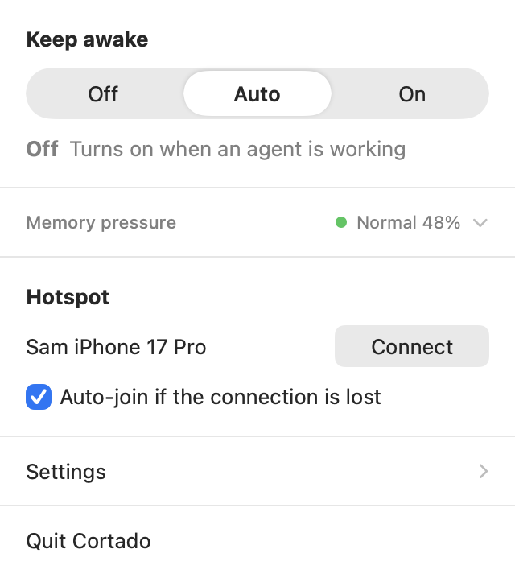
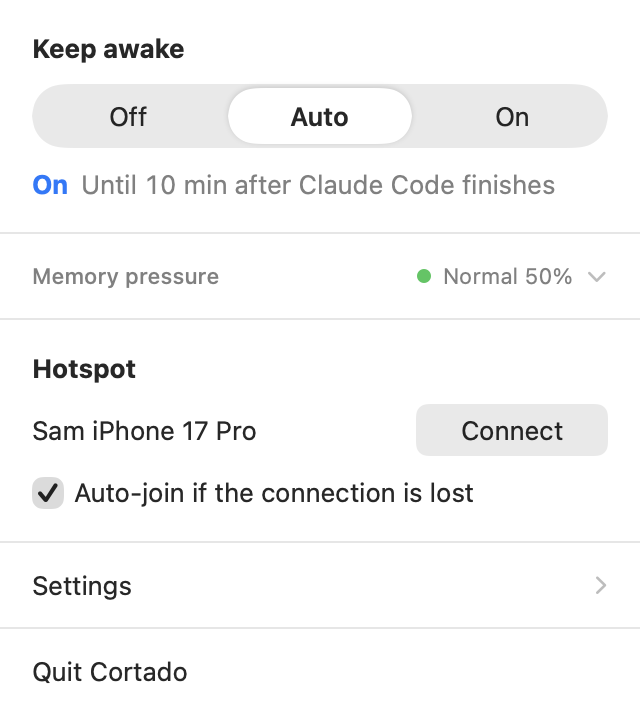
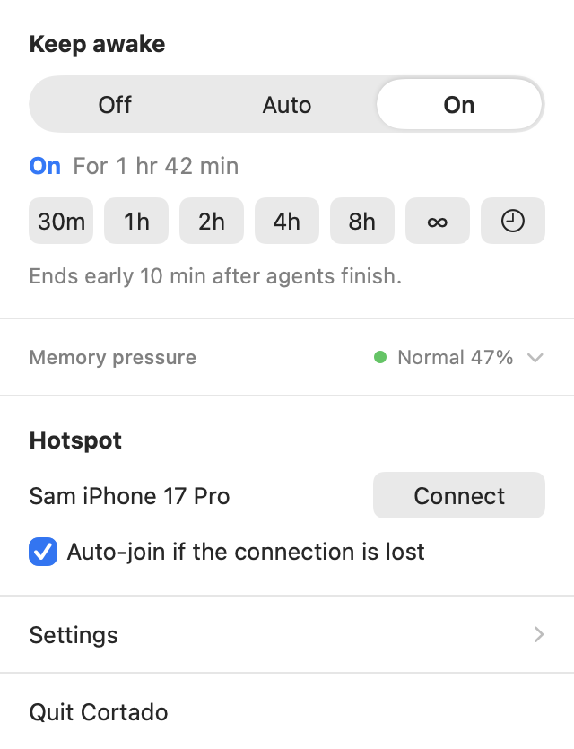
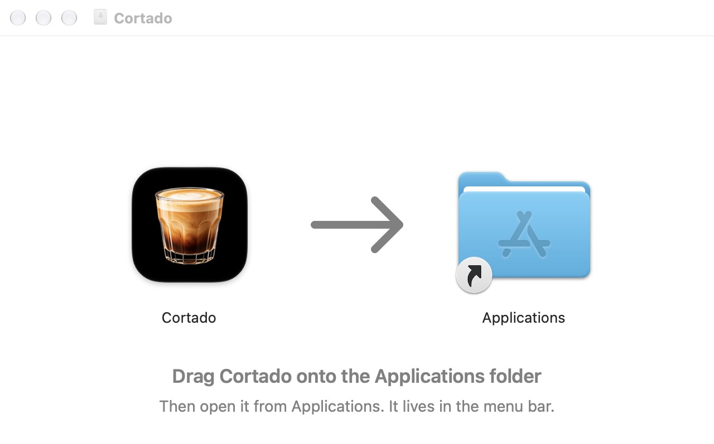
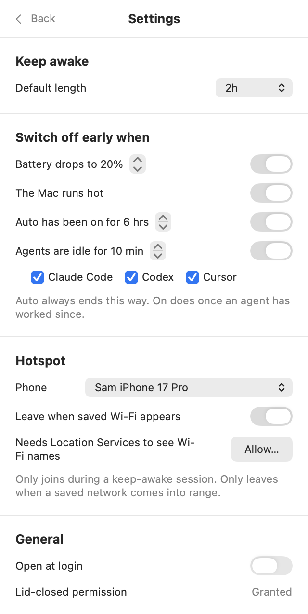
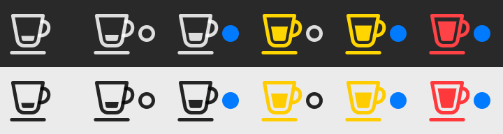
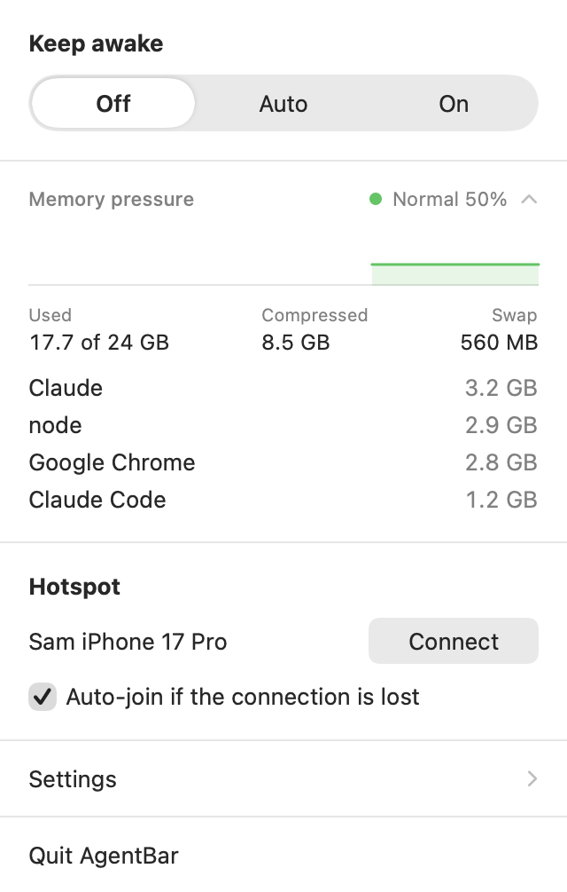

# Cortado

A small menu bar app for running coding agents on a MacBook: keep the Mac awake
with the lid closed for a set time, watch memory pressure, and fall back to a
phone hotspot when the internet drops.

<a href="https://github.com/upstoryteam/cortado/releases/latest/download/Cortado.dmg"></a>

For macOS 15 or later, on Apple silicon or Intel. [How to install it](#install).

Website: [build.upstory.co/cortado](https://build.upstory.co/cortado)

| Auto, waiting for an agent | Auto, while an agent works | On, for a set time |
| --- | --- | --- |
|  |  |  |

## Install

1. Download [Cortado.dmg](https://github.com/upstoryteam/cortado/releases/latest/download/Cortado.dmg)
   and open it.
2. Drag Cortado onto the Applications folder.
3. Open Cortado from Applications.



Cortado has no window and no Dock icon. It lives in the menu bar, as a small cup
at the top right of the screen. The first time it runs, its panel opens by
itself to show where.

It asks for three things, each once, and only if you want what they are for:

- **Staying awake with the lid closed**: click **Allow…** in the panel and
  approve with your Mac password. [Keep awake, lid closed](#keep-awake-lid-closed)
  says what that installs.
- **Opening at login**: a switch in Settings.
- **The hotspot**: pick your phone in Settings. To leave the hotspot when a
  saved Wi-Fi network appears, click **Allow…** there too, for Location access.

To remove it, see [Uninstall](#uninstall).

## Build

```sh
./build.sh            # builds build/Cortado.app
./build.sh install    # also copies it to /Applications and relaunches it
./build.sh dmg        # builds build/Cortado.dmg, the download
swift test            # two tests briefly toggle the real lid-closed override
```

Requires Xcode's Swift toolchain (Swift 6.2 or later) and macOS 15 or later.

`Package.swift` stamps the binary with the macOS 27 SDK at link time. SwiftPM
otherwise records the deployment target (15) as the SDK, and macOS 26 and later
then draw the app with the old controls instead of glass.

The icon is `Support/AppIcon.icns`, made from the square artwork beside it:

```sh
swift Support/icon.swift Support/AppIcon.png Support/AppIcon.icns
```

## Releasing

```sh
./build.sh dmg
gh release create v0.1.0 build/Cortado.dmg --title "Cortado 0.1.0"
```

`./build.sh dmg` builds the app for both Apple silicon and Intel, signs it for
other people's Macs, packs it into a disk image whose window says what to do
with it, and has Apple notarize the image. A Mac that downloads a notarized
image opens it without complaint. One that downloads anything else refuses to
open the app.

The version is in `Support/Info.plist`. The link under Install goes to the
newest release's `Cortado.dmg`, so the file keeps that name.

The Mac that builds a release needs two things, set up once:

- A **Developer ID Application** certificate in its keychain. Xcode makes one:
  Settings, Accounts, the team, Manage Certificates, the plus button. Only the
  team's account holder can.
- Notary credentials saved under the name `cortado`:

  ```sh
  xcrun notarytool store-credentials cortado --apple-id <Apple ID> --team-id <team ID>
  ```

  It asks for an app-specific password, made at account.apple.com.

Without the certificate the image is still built, for looking at its window,
and the script says it is not fit to hand out.

The picture behind the icons in that window is `Support/DiskImage.tiff`:

```sh
swift Support/dmg.swift Support/DiskImage.tiff
```

## What it does

### Keep awake, lid closed

One control with three positions, and a knob that slides to the one picked:

- **Off**: the Mac sleeps as usual, whatever agents are doing.
- **Auto**: on while agents work. When Claude Code, Codex or Cursor starts
  working, a session starts with no timer and lasts until they have been quiet
  for the grace period (default 10 minutes). Because the hotspot fallback is
  armed by a session, that comes on with it.
- **On**: on for the default length (two hours unless changed in Settings). The
  other lengths appear under it: 30m, 1h, 2h, 4h, 8h, ∞, and a clock for an end
  time on the half hour. Each length counts from now.

On lasts as long as its session. When that ends, the control is back on Auto or
Off, whichever it was on before.

- A timer that runs out while agents are still working, with Auto behind it,
  hands the session over to them instead of ending it.
- Going from On back to Auto does the same if agents are still at work, without
  letting go of the override in between.

The line under the control says whether it is on and what will change that.
**On** is bold and in the accent colour, the colour of the dot in the menu bar:

- **Off** Turns on when an agent is working
- **On** Until 10 min after Claude Code finishes
- **On** Claude Code idle, off in 8 min, once agents have been quiet for two
  minutes, counting down the rest of the grace period
- **On** Until 3:42 PM, for an end picked from the clock
- **On** For 1 hr 42 min, for a length

With the control on Off there is no line: the control has said it.

The control is drawn by the app. The Mac's segmented control moves its selection
in one jump, in every style it has, where the iPhone's slides. A click moves the
knob when it is let go, so the knob, the rows under it and the popover's height
all set off together. Picked up, the knob follows the pointer.

Rows come and go under the control as it changes. The sections below ease out of
their way and the popover eases to its new height, over a quarter of a second,
on one curve. `AppDelegate.resizePanel` steps the popover there on each frame
the display draws. Three things keep that smooth:

- `NSPopover` has an animation of its own for a change of size, and the whole
  app stands still while it runs, rows included. It is switched off for each step.
- Each step is a whole number of points. The popover hangs from its top edge,
  and a fraction there shakes it up and down.
- The status line changes its words at once. Faded, the old words show through
  the new ones.

All of it is skipped when Reduce Motion is on.

The menu bar icon carries a mark of its own: a ring while Auto is waiting for an
agent, a dot in the accent colour while it is on, and nothing while it is off.
The icon keeps one width whether or not the mark is there, so nothing in the
menu bar, and nothing in the open panel under it, moves when keep awake switches.

A session also ends early when any enabled rule fires (Settings):

- **Battery is low**: at or below the floor (default 20%) while unplugged.
- **Mac is running hot**: macOS reports serious thermal pressure for a minute.
- **Agents have finished**: for On, once an agent has worked during it and then
  been quiet for the grace period. If no agent ever works, the timer decides.



When a session ends with the lid shut and no display attached, the Mac is put to
sleep. With a display attached it is left alone, since someone may be using it.

How it works: closing the lid sleeps a Mac regardless of ordinary sleep
assertions. The override is `pmset disablesleep 1`, which needs root, so the app
uses a sudoers rule allowing exactly `pmset disablesleep 1` and `0` without a
password. If the rule is missing the panel offers to install it
(`/etc/sudoers.d/cortado`) behind the macOS administrator prompt. A watchdog
process restores normal sleep if the app dies mid-session, and the app also
restores it at next launch.

Sleep is also what switches the display off when the lid closes. With the
override on, the display would stay lit against the keyboard and heat the Mac.
So during a session the app looks every three seconds, and if the lid is shut
on a lit display it puts the display to sleep (`pmset displaysleepnow`). It
looks again each time because anything that wakes the display lights it again.
With another display attached, macOS switches the built-in one off by itself
and the app leaves both alone.

An agent counts as working when its session transcript was just written to
(`~/.claude/projects`, `~/.codex/sessions`, Cursor's `agent-transcripts`), which
macOS reports as it happens. During a session, an agent whose process tree is
using more than 10% of a CPU core also counts, which covers a long build that
leaves the transcript alone.

### Memory

The menu bar icon is a cortado cup that fills as memory pressure rises, the
figure macOS itself uses to decide when it is short of memory (100 minus the
"free percentage" that `memory_pressure` prints). It is not the share of memory
in use, which is normally far higher: macOS fills spare memory on purpose. It
turns yellow at the system's warning level and red at critical. The icon is
drawn in colour, so it is not a template image; it takes the menu bar's light or
dark colour each time it is drawn.



The panel gives it one line: the level and the figure. Clicking the line opens
the rest, and the panel remembers which way it was left: ten minutes of history,
used / compressed / swap, and the four apps using the most memory (your own
processes only; system daemons don't report usage without privileges).



### Hotspot

- **Connect** joins the phone's hotspot by name, using the saved password.
- **Auto-join if the connection is lost** is a checkbox in the panel. With it
  ticked, during a keep-awake session, including one that agents switched on,
  the app joins the hotspot by itself once the internet has been down for 20
  seconds. Outside a session it never joins automatically.
- While connected, a line says so, and what will end it: **Connected** Leaves
  when saved Wi-Fi appears.
- While on the hotspot, the app scans every three minutes and switches to a saved
  Wi-Fi network that comes into range (password-protected, decent signal, not
  another phone). Networks that were already in range when the hotspot was joined
  are left alone, since the hotspot was chosen over them. Scanning needs Location
  Services, because macOS hides network names otherwise.
- When a session ends, a hotspot the app joined is released.

## What it costs to run

Measured on the release build, on an M-series MacBook with about 600 processes
running. `Cortado --measure` (debug build) reprints these.

| State | CPU | Memory |
| --- | --- | --- |
| Idle, panel closed | 20 to 40 ms a minute (under 0.1% of one core) | 12 MB until the panel is first opened, about 30 MB after |
| Keep-awake session, panel closed | about 135 ms a minute (0.2%) | the same |

How it stays there:

- One timer, every three seconds, with a second of slack so macOS can fold the
  wake-up in with others. Idle, a tick reads five numbers from the kernel.
- The panel only exists while it is open. Closing it throws the view away;
  a hidden SwiftUI view would otherwise keep laying itself out.
- The menu bar icon is redrawn only when it would look different.
- Agents are noticed without polling. macOS reports writes to their transcripts
  as they happen, so waiting for an agent to start costs nothing, and a batch of
  fifty changes takes about a tenth of a millisecond to sort.
- The process list is read every tick while the panel is open with the memory
  line opened, every 15 seconds during a session that agents can end, and
  otherwise never.
- The crash watchdog sleeps on a pipe rather than polling.
- Wi-Fi scans happen only while on the hotspot, three minutes apart.
- Nothing is kept that grows: ten minutes of pressure history, one process
  sample, and that's all.

## Layout

| File | Role |
| --- | --- |
| `SessionController.swift` | Sessions, starting them for agents, the early-stop rules, crash recovery |
| `PowerControl.swift` | `pmset`, the sudoers rule, lid, battery and thermal sensors |
| `AgentMonitor.swift` | Detecting whether agents are working |
| `MemoryMonitor.swift`, `ProcessSnapshot.swift` | Memory statistics and per-app usage |
| `HotspotController.swift` | Fallback to the hotspot and switching back to Wi-Fi |
| `PanelView.swift`, `SettingsView.swift`, `StatusIcon.swift` | Interface |
| `Snapshot.swift` | Debug only: `--snapshot <folder>` renders the UI to PNGs, `--show-panel <file>` opens and clicks the real popover, `--film <folder>` saves each change of the control frame by frame with the window's size and any stall, `--diagnose` runs a live session and kills the app to test the watchdog, `--measure` times everything the app repeats |

## Uninstall

Quit Cortado, delete `/Applications/Cortado.app`, and if the app installed its
own rule, `sudo rm /etc/sudoers.d/cortado`.

## License

MIT. See [LICENSE](LICENSE).
